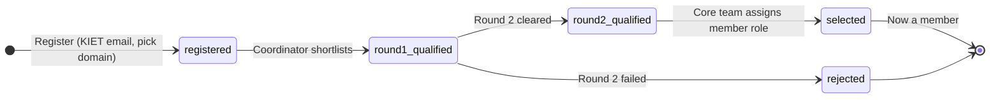
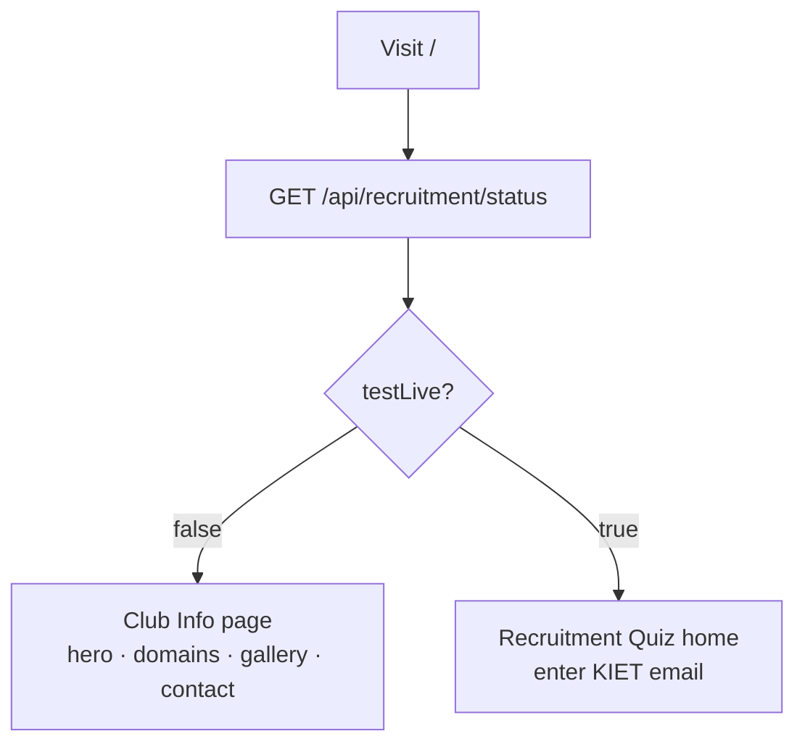
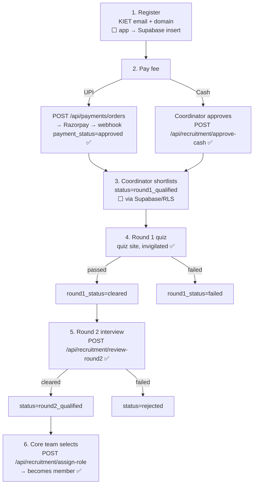
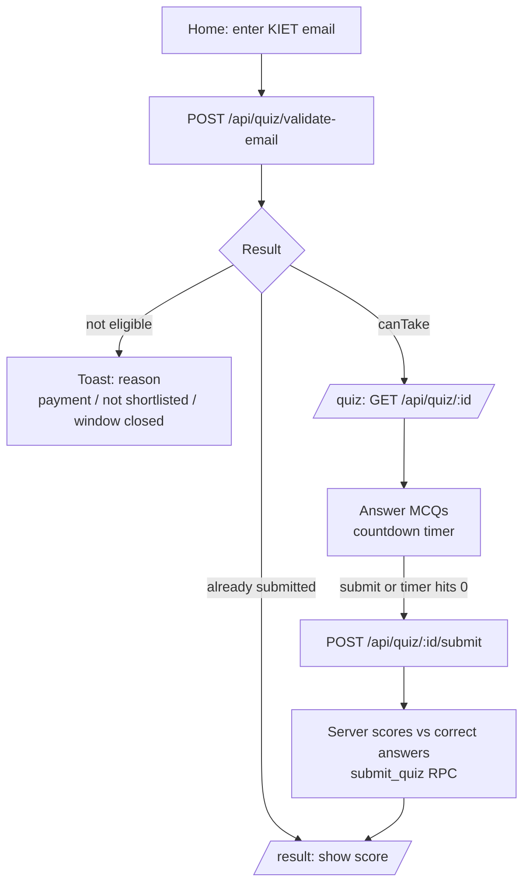
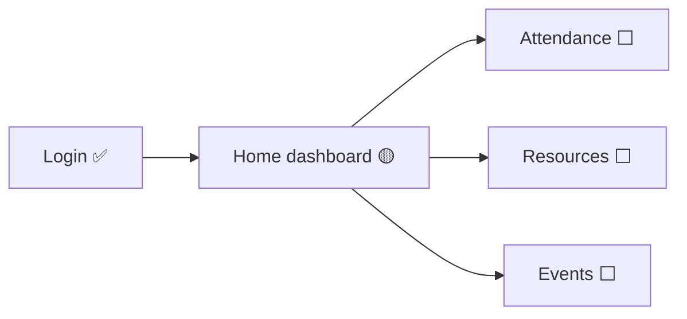

# 10 — User Flows

Exact, code-grounded user journeys for every user type in **Club Innogeeks**.
This is the reference we'll use when refining the UI.

> Each flow is tagged with where it actually stands today:
>
> - ✅ **Built** — implemented and working in code
> - 🟡 **Partial** — shell/placeholder exists, logic incomplete
> - ⬜ **Planned** — specced in `docs/` only, no working code yet
>
> Verified against `artifacts/api-server/src/routes/*`, `artifacts/quiz-site/src/*`,
> `artifacts/android/app/src/main/java/com/example/innogeeks/*`, and `lib/db/src/schema/*`.

---

## 1. The cast — user types

| User type | Who they are | Identity / auth |
| :--- | :--- | :--- |
| **Public / Prospective student** | Anyone visiting the site or app before joining | None |
| **Applicant** | A KIET student going through recruitment | KIET email; Supabase Auth (app) + email-only identity (quiz site) |
| **Member** | A selected student in one of the 5 domains | Supabase Auth, role `member` |
| **Coordinator** | Runs a single domain (android/web/ml/iot/arvr) | Supabase Auth, role `coordinator` |
| **Core team** | Runs the whole club | Supabase Auth, role `core_team` |

**Roles** (`role` enum): `public` → `member` → `coordinator` → `core_team`
**Domains** (`domain` enum): `android`, `web`, `ml`, `iot`, `arvr`

---

## 2. The surfaces — where flows happen

| Surface | Path / location | Auth model | Status |
| :--- | :--- | :--- | :--- |
| **Quiz site (public)** | `artifacts/quiz-site` `/` | No login (KIET email only) | ✅ Built |
| **Quiz site (admin)** | `artifacts/quiz-site` `/admin/club-info` | Supabase email+password login | ✅ Built |
| **Android app** | `artifacts/android` | Supabase Auth | 🟡 Auth + home shell only |
| **API server** | `artifacts/api-server` `/api` | Bearer JWT verified server-side | ✅ Built |

**Trust boundary:** Android + quiz site talk to Supabase directly (RLS enforces who
can read/write what). The Express API server only handles things that need
service-role trust or secrets: Razorpay, quiz scoring, role promotion, Cloudinary
signing, recruitment-window state.

---

## 3. Recruitment state machine (the spine of everything)

An applicant row (`recruitment_applications`) tracks **four independent fields**.
`status` is the headline; the other three are gates along the way.



Parallel gate fields (must line up before the next step):

| Field | Values | Set by |
| :--- | :--- | :--- |
| `payment_status` | `pending` → `cash_pending` → `approved` / `rejected` | UPI webhook (auto) **or** coordinator cash approval |
| `round1_status` | `pending` → `cleared` / `failed` | Quiz submit (auto-scored) |
| `round2_status` | `pending` → `cleared` / `failed` | Coordinator/core team Round 2 review |
| `status` | `registered` → `round1_qualified` → `round2_qualified` → `selected` / `rejected` | Shortlisting + Round 2 review + role assignment |

**Key gate to sit Round 1:** `payment_status = approved` **AND** `status = round1_qualified`
**AND** `round1_status = pending` **AND** an open recruitment window + published quiz
for the exact `academic_year`.

---

## 4. Public / Prospective student

**Goal:** learn about the club; during recruitment, find the way in.

### 4.1 Visiting the quiz site `/` — ✅ Built

- `testLive` is true only when a recruitment window is **open** *and* a quiz is
  **published** for that year. Otherwise everyone sees the public Club Info page.
- Club Info content is read from `GET /api/club-info` (managed by core team).

### 4.2 Opening the Android app (before joining) — ⬜ Planned
- Spec: see public club info / recruitment CTA, then sign up to apply.
- Today: app opens to a **login screen**; no public/onboarding screen yet.

---

## 5. Applicant — the recruitment journey

This journey **spans two surfaces**: the **Android app** (authenticated:
register + pay + track status) and the **quiz site** (no-login, invigilated PCs:
Round 1 test).



### Step detail

| # | Step | Surface | Mechanism | Status |
| :- | :--- | :--- | :--- | :--- |
| 1 | Register (KIET email, name, roll, domain) | Android app | Direct Supabase insert (RLS) — no trusted endpoint | ⬜ Planned |
| 2a | Pay by **UPI** | Android app | `POST /api/payments/orders` → Razorpay order; webhook `payment.captured` sets `payment_status=approved` | ✅ Built (server) / ⬜ app UI |
| 2b | Pay by **cash** | In person | Coordinator/core team `POST /api/recruitment/approve-cash` (own domain only for coordinators) | ✅ Built (server) |
| 3 | Shortlist for Round 1 | Admin | Set `status=round1_qualified` via Supabase (RLS) — **no dedicated trusted endpoint today** | ⬜ Gap |
| 4 | Round 1 quiz | **Quiz site** | `validate-email` → `GET /quiz/:id` → `submit` (auto-scored, sets `round1_status`) | ✅ Built |
| 5 | Round 2 interview | Admin | `POST /api/recruitment/review-round2` (requires `round1_status=cleared`) | ✅ Built (server) |
| 6 | Final selection | Core team | `POST /api/recruitment/assign-role` → `assign_member_role` RPC promotes to `member` | ✅ Built (server) |

### 5.1 Round 1 quiz (quiz site) — ✅ Built, step-by-step

Server guarantees (all enforced in `quiz.ts`):
- Only `@kiet.edu` emails.
- Window must be open for the applicant's exact `academic_year` (no year fallback).
- `GET /quiz/:id` never returns `correct_option_index`.
- Submit re-checks payment, shortlist, window, and that the quiz is the one assigned
  to the application; one attempt only.

---

## 6. Member — ⬜ mostly Planned (🟡 home shell)

**Goal:** day-to-day club life after selection.

| Flow | What they do | Status |
| :--- | :--- | :--- |
| Home dashboard | See role-based cards | 🟡 Shell in `HomeScreen.kt`, cards have no destination |
| Attendance | View personal attendance + session history | ⬜ Planned (schema exists) |
| Resources | Browse domain folders (PDFs/links) | ⬜ Planned |
| Events | See upcoming events, register if eligible | ⬜ Planned (`event_status`, `registration_scope` enums exist) |



---

## 7. Coordinator — runs one domain

Inherits all member abilities, scoped to **their own domain**.

| Flow | Mechanism | Status |
| :--- | :--- | :--- |
| Approve cash payments (own domain) | `POST /api/recruitment/approve-cash` | ✅ Built (server) |
| Review Round 2 (own domain) | `POST /api/recruitment/review-round2` | ✅ Built (server) |
| Create attendance sessions + mark presence | Supabase (RLS) | ⬜ Planned |
| Manage resources (signed Cloudinary upload) | `POST /api/cloudinary/sign` + Supabase | 🟡 Signing built; UI planned |
| Coordinator tools entry | `HomeScreen.kt` card (role-gated) | 🟡 Placeholder only |

> Domain scoping is enforced server-side: a coordinator acting outside their
> `domain` gets `403`. Core team bypasses the domain check.

---

## 8. Core team — runs the club

Full access. Inherits coordinator + member abilities across **all domains**.

| Flow | Mechanism | Status |
| :--- | :--- | :--- |
| Open/close recruitment window | `POST /api/recruitment/window` | ✅ Built (server) |
| Final selection → promote to member | `POST /api/recruitment/assign-role` | ✅ Built (server) |
| Change any user's role/domain | `POST /api/admin/set-role` (can't change own) | ✅ Built (server) |
| Approve cash / review Round 2 (any domain) | same endpoints, no domain restriction | ✅ Built (server) |
| Edit public Club Info page | `PUT /api/club-info` (+ audit history row) | ✅ Built |
| View Club Info edit history | `GET /api/club-info/history` | ✅ Built |

### 8.1 Club Info admin (quiz site `/admin/club-info`) — ✅ Built
```mermaid
flowchart TD
    A[/admin/club-info] --> B{Logged in?}
    B -- no --> C[Email + password login<br/>Supabase Auth]
    B -- yes --> D[Editor: hero · about · domains · gallery · socials]
    D --> E[Image upload<br/>POST /api/cloudinary/sign → Cloudinary]
    D --> F[Save → PUT /api/club-info]
    F --> G[History panel refreshes<br/>GET /api/club-info/history]
```
> Any authenticated user can load the editor shell, but **only core team can save**
> — `PUT /club-info` is `requireCoreTeam`, enforced server-side. Each save writes a
> snapshot to `club_info_history` (who + when), surfaced in the side panel.

---

## 9. Capability matrix (server-enforced)

| Capability | Public | Member | Coordinator | Core team |
| :--- | :--: | :--: | :--: | :--: |
| View Club Info / recruitment status | ✅ | ✅ | ✅ | ✅ |
| Take Round 1 quiz (if eligible) | ✅* | ✅* | ✅* | ✅* |
| Create UPI payment order | — | ✅ | ✅ | ✅ |
| Cloudinary signed upload | — | ✅ | ✅ | ✅ |
| Approve cash payment | — | — | ✅ own domain | ✅ all |
| Review Round 2 | — | — | ✅ own domain | ✅ all |
| Open/close recruitment window | — | — | — | ✅ |
| Assign member role (final selection) | — | — | — | ✅ |
| Change user roles | — | — | — | ✅ |
| Edit Club Info + view history | — | — | — | ✅ |

\* Quiz access is identity-by-KIET-email on invigilated PCs, gated by payment +
shortlist + open window — not by login role.

---

## 10. Known gaps to resolve before/while refining UI

1. **Registration has no trusted endpoint** — initial application insert relies on
   Supabase RLS directly; no Android UI yet.
2. **Shortlisting (`status=round1_qualified`) has no endpoint or UI** — currently a
   manual DB/RLS update. This is the one step with no front door.
3. **Android feature modules** (recruitment, attendance, resources, admin) are
   specced but not built — only login + a home shell exist.
4. **Member/coordinator surfaces** (attendance, resources, events) exist in the DB
   schema and docs but have no UI.
5. **Single-open-window** isn't enforced at the DB level (see
   `.agents/memory/recruitment-window-invariant.md`).
