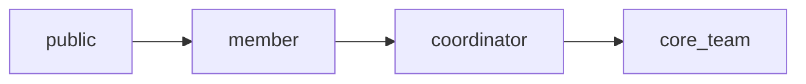

# 11 — User Scopes, Separations & Feature Definition

The complete, code-grounded definition of **who can do what, where, and why** —
the foundation we lock down *before* designing the UI.

Pairs with `docs/10_USER_FLOWS.md` (the step-by-step journeys).

> **Status legend** (be precise — "backend exists" ≠ "done"):
>
> - ✅ **Live** — backend **and** a working UI exist
> - 🟡 **Backend-ready** — data model + RLS/endpoints exist, **no UI yet**
> - ⬜ **Planned** — not built (spec only)

---

## Part A — User Scopes

Four roles, strictly cumulative. Each role inherits everything below it.

### A1. Public (no login)
- **Identity:** none.
- **Sees:** Club Info page, recruitment "is it live?" status, published event listings
  (open scope), the Round 1 quiz portal (when live).
- **Can do:** browse; begin the Round 1 quiz via KIET-email identity (no account).
- **Cannot:** read any private data — RLS only exposes `is_published`/`open`-scoped rows
  through the anon key.

### A2. Member
- **Identity:** Supabase Auth account, `role = member`, assigned one `domain`.
- **Scope:** their **own** records + their **own domain's** shared content.
- **Can do:** edit own profile (name/year); view own attendance; browse own-domain
  resources; view events and register (member-scoped events included); create UPI
  payment orders; signed Cloudinary uploads (where permitted).
- **Cannot:** see other domains' resources/attendance; mark attendance; manage content.

### A3. Coordinator
- **Identity:** Supabase Auth, `role = coordinator`, owns one `domain`.
- **Scope:** everything a member has **+ write access scoped to their own domain**.
- **Can do (own domain only):** create attendance sessions & mark presence; manage
  resource folders/files; create/manage events & mark event attendance; approve cash
  payments; review Round 2 interviews.
- **Cannot:** act on other domains (RLS + server return `403`); open/close recruitment
  windows; change roles; edit Club Info; do final member selection.

### A4. Core team
- **Identity:** Supabase Auth, `role = core_team`. **No domain restriction.**
- **Scope:** global — overrides all domain scoping.
- **Can do:** everything coordinators can, across **all domains**, **plus**: open/close
  recruitment windows; publish quizzes; final selection (promote applicant → member);
  change any user's role/domain (audited, cannot change own); edit Club Info + view edit
  history; view global reports.
- **Cannot:** change their own role; rewrite `quiz_submissions` (read-only after scoring).

---

## Part B — The Separations (the boundaries that define the system)

### B1. Role separation
4 roles, cumulative (A1–A4). Enforced two ways: **RLS** (`current_user_role()`,
`current_user_domain()` helpers) for Supabase-direct access, and **middleware**
(`requireAuth`, `requireRole`, `requireCoordinator`, `requireCoreTeam`) on the API server.

### B2. Domain separation
5 domains: `android`, `web`, `ml`, `iot`, `arvr`. Members and coordinators are bound to
**one** domain. RLS gates domain-scoped tables with `domain = current_user_domain()`.
Core team bypasses this. **Examples:** a Web coordinator cannot mark IoT attendance,
approve an ML applicant's cash, or see Android resources.

### B3. Surface separation (where each role lives)
| Surface | Primary users | Auth | Status |
| :--- | :--- | :--- | :--- |
| **Quiz site — public** (`/`) | Public, applicants | None (KIET email) | ✅ Live |
| **Club Info admin** (`/admin/club-info`) | Core team | Supabase email+password | ✅ Live |
| **Android app** | Members, coordinators, core team | Supabase Auth | 🟡 Login + home shell only |
| **API server** (`/api`) | All (trust boundary) | Bearer JWT | ✅ Live |

> ⚠️ **Open decision:** the member/coordinator/core-team experience is currently
> specced for **Android only**, which can't be built or run inside Replit. See Part E.

### B4. Trust separation (Supabase-direct vs Express)
- **Supabase-direct (RLS):** high-volume, ownership-checkable reads/writes — attendance,
  resources, events, registration insert, profile edits. The client holds a user JWT;
  RLS is the guard.
- **Trusted Express (service-role):** anything needing secrets, atomicity, or server
  trust — Razorpay orders + webhook, quiz scoring (`submit_quiz` RPC), final role
  assignment (`assign_member_role` RPC), Cloudinary signing, recruitment-window state,
  Club Info writes.

### B5. Data-visibility separation
`public (anon, published/open only)` ⊂ `authenticated (own + own-domain)` ⊂
`coordinator (own domain write)` ⊂ `core_team (all)`. Audited writes
(`role_change_log`, `club_info_history`) record **who + when**.

---

## Part C — Complete Feature Catalog

### C1. Recruitment
| Sub-feature | Who | Tables | Ops | Status |
| :--- | :--- | :--- | :--- | :--- |
| Open/close recruitment window | Core team | `recruitment_windows` | Express | 🟡 no UI |
| Register application (KIET email + domain) | Applicant | `recruitment_applications` | Supabase (RLS) | ⬜ no endpoint/UI |
| Pay fee — UPI | Applicant | `recruitment_applications` | Express + Razorpay webhook | 🟡 server only |
| Pay fee — cash approval | Coordinator (own) / Core | `recruitment_applications` | Express | 🟡 no UI |
| Shortlist for Round 1 (`status=round1_qualified`) | Coordinator / Core | `recruitment_applications` | Supabase (RLS) | ⬜ **gap: no endpoint/UI** |
| Round 1 quiz (take + auto-score) | Applicant | `quizzes`, `quiz_questions`, `quiz_submissions` | Express (scoring) | ✅ Live (quiz site) |
| Author/publish quizzes | Core team | `quizzes`, `quiz_questions` | Supabase (RLS), Core | 🟡 no UI |
| Round 2 interview review | Coordinator (own) / Core | `recruitment_applications` | Express | 🟡 no UI |
| Final selection → member | Core team | `recruitment_applications`, `profiles`, `role_change_log` | Express RPC | 🟡 no UI |

### C2. Club Info
| Sub-feature | Who | Tables | Ops | Status |
| :--- | :--- | :--- | :--- | :--- |
| View public page | Public | `club_info` | Express (public GET) | ✅ Live |
| Edit hero/about/domains/gallery/socials | Core team | `club_info`, `club_info_history` | Express | ✅ Live |
| View edit history (who/when) | Core team | `club_info_history` | Express | ✅ Live |

### C3. Attendance
| Sub-feature | Who | Tables | Ops | Status |
| :--- | :--- | :--- | :--- | :--- |
| Create session (own domain) | Coordinator / Core | `attendance_sessions` | Supabase (RLS) | 🟡 no UI |
| Mark presence | Coordinator / Core | `attendance_records` | Supabase (RLS) | 🟡 no UI |
| View own attendance + history | Member | `attendance_records`, `attendance_sessions` | Supabase (RLS) | 🟡 no UI |

### C4. Resources
| Sub-feature | Who | Tables | Ops | Status |
| :--- | :--- | :--- | :--- | :--- |
| Create folders (own domain) | Coordinator / Core | `resource_folders` | Supabase (RLS) | 🟡 no UI |
| Upload PDF / add link | Coordinator / Core | `resources` | Supabase + Cloudinary sign | 🟡 sign built, no UI |
| Browse own-domain resources | Member | `resource_folders`, `resources` | Supabase (RLS) | 🟡 no UI |

### C5. Events
| Sub-feature | Who | Tables | Ops | Status |
| :--- | :--- | :--- | :--- | :--- |
| Create/manage events (draft/published/past) | Coordinator / Core | `events` | Supabase (RLS) | 🟡 no UI |
| Set scope (open vs members_only) | Coordinator / Core | `events` | Supabase (RLS) | 🟡 no UI |
| View events | Public (open) / Member (all) | `events` | Supabase (RLS) | 🟡 no UI |
| Register for event | Member (or public, open scope) | `event_registrations` | Supabase (RLS) | 🟡 no UI |
| Mark event attendance | Coordinator / Core | `event_registrations` | Supabase (RLS) | 🟡 no UI |

### C6. Membership & Roles
| Sub-feature | Who | Tables | Ops | Status |
| :--- | :--- | :--- | :--- | :--- |
| Edit own profile (name/year) | Member+ | `profiles` | Supabase (RLS) | 🟡 no UI |
| Change user role/domain (audited) | Core team | `profiles`, `role_change_log` | Express | 🟡 no UI |
| View role-change audit log | Core team | `role_change_log` | Supabase (RLS) | 🟡 no UI |

### C7. Planned (not in schema yet)
- **Analytics** — recruitment funnel, attendance %, participation (Core team). ⬜
- **Notifications** — status-change emails/push to applicants & members. ⬜

---

## Part D — Master capability matrix (all features × roles)

| Capability | Public | Member | Coordinator | Core team |
| :--- | :--: | :--: | :--: | :--: |
| Browse Club Info / status | ✅ | ✅ | ✅ | ✅ |
| Take Round 1 quiz (if eligible) | ✅¹ | ✅¹ | ✅¹ | ✅¹ |
| Register + pay (recruitment) | ✅² | — | — | — |
| Edit own profile | — | ✅ | ✅ | ✅ |
| View own attendance | — | ✅ | ✅ | ✅ |
| Browse domain resources | — | ✅ own | ✅ own | ✅ all |
| Register for events | — | ✅ | ✅ | ✅ |
| Create attendance / mark presence | — | — | ✅ own | ✅ all |
| Manage resources / folders | — | — | ✅ own | ✅ all |
| Create / manage events | — | — | ✅ own | ✅ all |
| Approve cash / review Round 2 | — | — | ✅ own | ✅ all |
| Open/close window, publish quiz | — | — | — | ✅ |
| Final selection (assign member) | — | — | — | ✅ |
| Change roles / view audit log | — | — | — | ✅ |
| Edit Club Info + history | — | — | — | ✅ |

¹ Quiz access = KIET-email identity on invigilated PCs, gated by payment + shortlist +
open window (not by login role).
² Applicants are "public" until selected; the recruitment account is a pre-member state.

---

## Part E — Open decisions to finalize the definition

These shape **what UI we build**, so let's settle them before design:

1. **Surface strategy (biggest one).** Member / coordinator / core-team features are
   currently specced for **Android only**, which Replit can't build or run. Options:
   - **(A) Web app** — build a web dashboard for members/coordinators/core team here
     (buildable + testable now); keep Android as a later port.
   - **(B) Android-only** — keep specs Android-only; we'd only design, not run it here.
   - **(C) Hybrid** — web for admin/coordinator tooling, Android for members.

2. **First build target.** Which area gets the first real UI? e.g. recruitment admin
   (fills the biggest gaps: shortlisting, Round 2, selection), or the member dashboard
   (attendance + resources + events), or the applicant register/pay flow.

3. **Close the two recruitment gaps** — registration and shortlisting currently have no
   front door. Confirm both should become proper screens (and trusted endpoints where
   needed).

4. **Catalog completeness** — anything to add or drop before we design (e.g. promote
   Analytics/Notifications into scope now, or defer).
